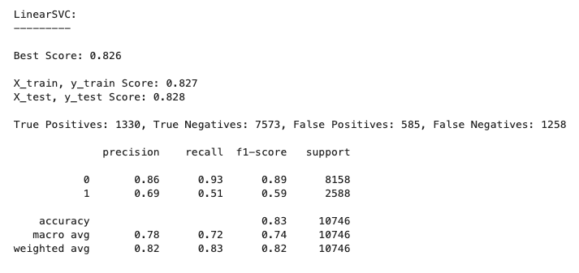

## DSI Project 4 was a team-based competition. The goal was to create the best performing model on a hold-out sample of data, given a constraint.

### Our team worked under the following constraint:

### Team Features Constraint
- Your choice of algorithm
- **Limited to a maximum of 20 features**
- Your choice of samples

## Deliverables
Your team will have until 5:00pm EST / 2:00pm PST to build the best model possible under those constraints.

- Notebooks/Modeling, prediction csv, and slide deck done by 5pm EST
- Group presentations with slidedeck between 5-6pm EST
- Repo with README.md due by midnight EST

## The task:
- To create a model to predict whether a person's income was > $50K given certain data.
- Generate predicted probabilities of income being > $50K for each row in the test set. 
- Create a csv with a single column of the probability  **_with 'wage' as a header_**. 

## Data Dictionary

|Feature|Type|Description|
|---|---|---|
|wage|int|Annual Salary|
|married|int|Marital Status|
|education-num|int|Level of Education|
|age|int|Age|
|hours-per-week|int|Number of Hours Worked per Week|
|male|int|Sex|
|hours-per-week^2|float|The square of hours-per-week|
|workclass_Self-emp-inc|int|Self Employed - Incorporated|
|workclass-gov|int|Employed by the Government|
|US|int|Born in the US or Abroad|
|workclass_Self-emp-not-inc|int|Self Employed - Not Incorporated|
|workclass_Never-worked|int|Never Employed|
|fnlwgt|float|Socioeconomic Ranking|
|fnlwgt^2|float|The Square of fnlwgt|
|workclass_Without-pay|int|Unemployed|
|workclass_?|int|Unknown Work History|
|workclass_Private|int|Employed by Private Company|
|seperated|int|Marital Seperation|
|single|int|Unmarried|
  
   
## Four Models were created and optimized using pipelines.   
  
Of the four models, Random Forest performed the best. The model metrics are below:  
  
Overall Model Metrics Table  
---------------------------  
  
    
  
# Individual Model Metrics  
    
MultinomialNB    
-------------  
    
    
    
LogisticRegression    
------------------  
    
     
      
LinearSVC    
---------    
    
    
     
RandomForestClassifier     
----------------------    
    
      
